# 📐 Documento de Arquitetura de Software — Inventário de Bobinas Videplast

## Visão Enterprise | v2.2

**Classificação**: Interno — Uso Restrito  
**Última Atualização**: Julho/2026  
**Responsável**: Equipe de Engenharia — Videplast  
**Status**: Em Produção  
**Versão Atual**: v2.2 — Pipeline de Decodificação Progressivo (Early Exit) + Métricas de Performance  

---

## Índice

1. [Visão Arquitetural da Solução](#1-visão-arquitetural-da-solução)
2. [Contexto de Negócio e Requisitos](#2-contexto-de-negócio-e-requisitos)
3. [Arquitetura de Alto Nível (HLD)](#3-arquitetura-de-alto-nível-hld)
4. [Arquitetura Detalhada (LLD)](#4-arquitetura-detalhada-lld)
5. [Diagramas C4 (Contexto, Contêineres e Componentes)](#5-diagramas-c4)
6. [Justificativas para Decisões Técnicas (ADRs)](#6-justificativas-para-decisões-técnicas-adrs)
7. [Estratégia de Escalabilidade](#7-estratégia-de-escalabilidade)
8. [Alta Disponibilidade e Recuperação de Desastres (DR)](#8-alta-disponibilidade-e-recuperação-de-desastres-dr)
9. [Estratégia de Segurança](#9-estratégia-de-segurança)
10. [Estratégia de Observabilidade](#10-estratégia-de-observabilidade)
11. [Estratégia de Integração](#11-estratégia-de-integração-entre-sistemas)
12. [Governança e Padrões de Desenvolvimento](#12-governança-e-padrões-de-desenvolvimento)
13. [CI/CD, DevSecOps e Automação](#13-cicd-devsecops-e-automação)
14. [Gestão de Custos e FinOps](#14-gestão-de-custos-e-otimização-de-recursos-finops)
15. [Riscos Arquiteturais e Mitigações](#15-riscos-arquiteturais-e-planos-de-mitigação)
16. [Requisitos Não Funcionais](#16-requisitos-não-funcionais-e-mecanismos-de-atendimento)
17. [Proposta de Evolução Arquitetural (Roadmap)](#17-proposta-de-evolução-arquitetural)

---

## 1. Visão Arquitetural da Solução

### 1.1 Resumo Executivo

O **Inventário de Bobinas** é uma solução digital de **inventário físico e conciliação de estoque** desenvolvida para a Videplast, líder no setor de embalagens flexíveis com operações em 7 filiais no Brasil. A aplicação substitui processos manuais em papel por uma plataforma digital mobile-first que permite a operadores logísticos realizar a contagem física de bobinas utilizando múltiplos métodos de captura (leitor USB, câmera de celular, drone com IA), cruzando automaticamente os dados com a base oficial do SAP.

### 1.2 Proposta de Valor

| Stakeholder | Valor Entregue |
|-------------|----------------|
| **Operadores Logísticos** | Interface intuitiva no celular, redução de erros manuais, feedback instantâneo de validação |
| **Gestores de Estoque** | Visão consolidada em tempo real, relatórios exportáveis, rastreabilidade completa por operador/data |
| **TI / Infraestrutura** | Solução serverless (Supabase) + containers (Docker), sem necessidade de gerenciar servidores |
| **Financeiro** | Redução drástica do custo operacional do inventário cíclico e anual |
| **Auditoria** | Trilha completa: quem bipou, quando, onde, qual sessão, divergências SAP vs físico |

### 1.3 Contexto Estratégico

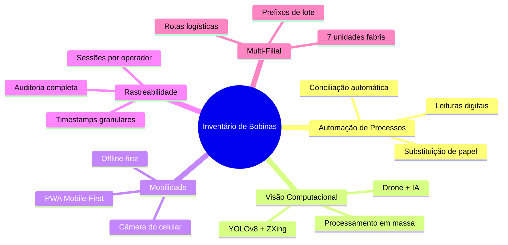

---

## 2. Contexto de Negócio e Requisitos

### 2.1 Problema de Negócio

A Videplast opera com milhares de bobinas distribuídas em depósitos, galpões e gôndolas de múltiplas filiais. O inventário físico tradicional envolvia:

- **Contagem manual** com pranchetas e canetas
- **Digitação posterior** em planilhas Excel
- **Cruzamento manual** com dados exportados do SAP
- **Tempo de execução**: Dias inteiros para cada inventário cíclico
- **Taxa de erro**: Significativa devido a digitação manual e releitura

### 2.2 Solução Proposta

Uma plataforma digital que:

1. **Captura** dados de bobinas via 3 métodos (leitor USB, câmera, drone)
2. **Valida** cada leitura contra regras de negócio complexas (prefixos, agrupadores, QR codes estruturados)
3. **Cruza** automaticamente com dados SAP importados via CSV
4. **Classifica** cada bobina em 4 status: OK, Faltando, Sobra, Local Incorreto
5. **Exporta** relatório conciliado compatível com Excel brasileiro

### 2.3 Requisitos de Negócio

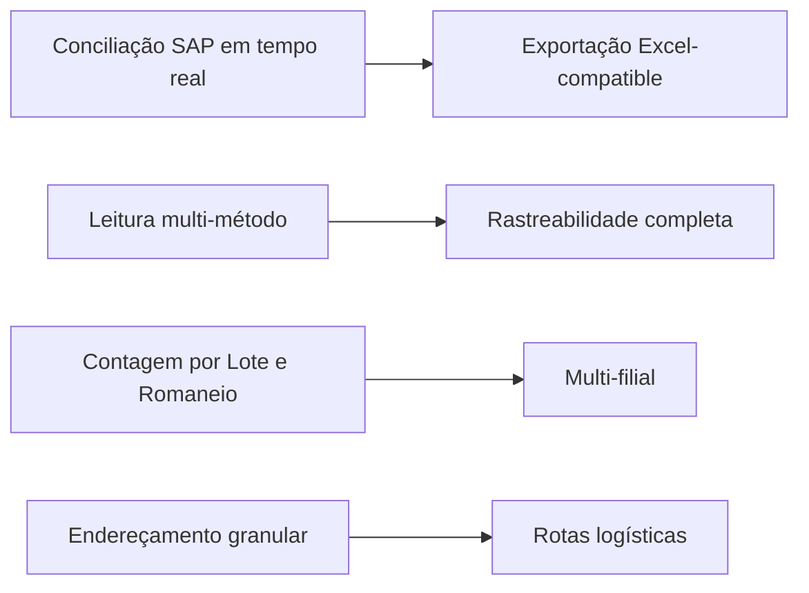

### 2.4 Personas

| Persona | Descrição | Necessidade Principal |
|---------|-----------|----------------------|
| **Operador de Galpão** | Funcionário com crachá, usa celular Android no chão de fábrica | Interface rápida e intuitiva para bipar sem erros |
| **Coordenador de Logística** | Gestor que importa planilhas SAP e gera relatórios | Visão consolidada, filtros avançados, exportação |
| **Operador de Drone** | Operador que filma corredores com drone | Upload simples e feedback claro do processamento |
| **Administrador TI** | Responsável por manter o sistema em produção | Deploy simples, monitoramento, segurança |

---

## 3. Arquitetura de Alto Nível (HLD)

### 3.1 Visão Geral do Sistema

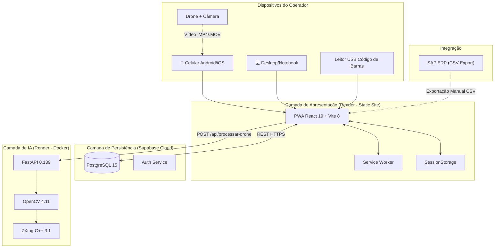

### 3.2 Características da Arquitetura

| Característica | Descrição |
|---------------|-----------|
| **Estilo Arquitetural** | Client-heavy SPA + Microsserviço de IA |
| **Comunicação** | Síncrona (REST HTTPS) |
| **Persistência** | PostgreSQL gerenciado (Supabase) + SessionStorage local |
| **Deploy** | Static Site (frontend) + Docker Container (backend) |
| **Escalabilidade** | Horizontal no backend, CDN no frontend |
| **Resiliência** | Cache local + retry patterns + fallback offline |

---

## 4. Arquitetura Detalhada (LLD)

### 4.1 Componentes do Frontend

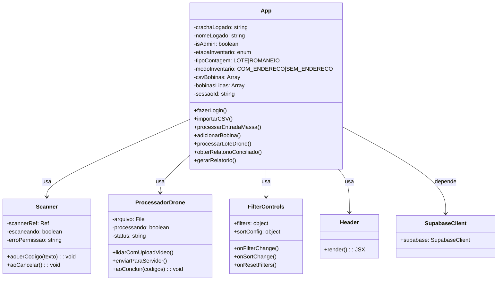

### 4.2 Máquina de Estados do Inventário

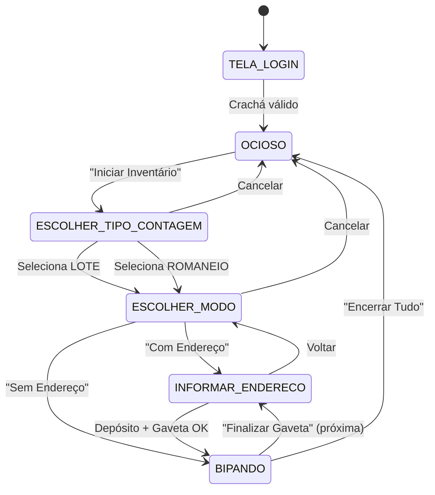

### 4.3 Pipeline de Processamento de Vídeo (Backend)

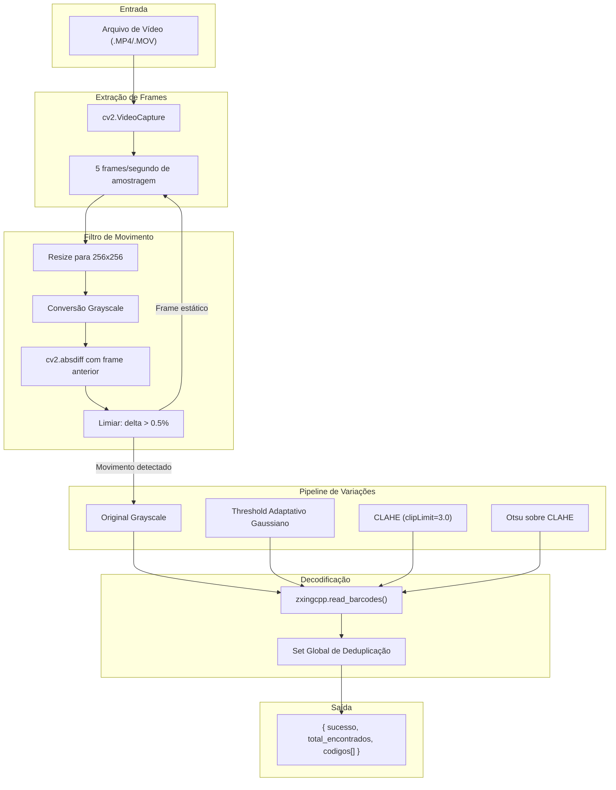

### 4.4 Modelo de Dados (Supabase PostgreSQL)

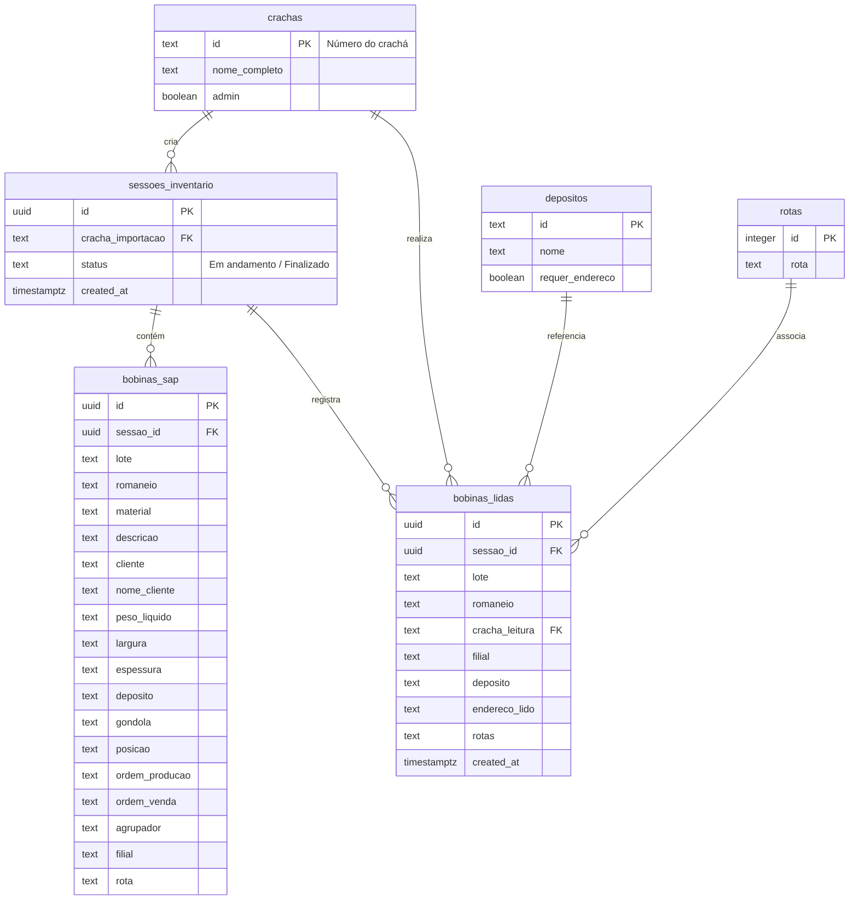

---

## 5. Diagramas C4

### 5.1 Nível 1 — Contexto do Sistema

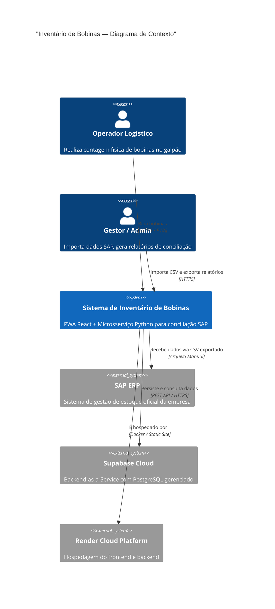

### 5.2 Nível 2 — Contêineres

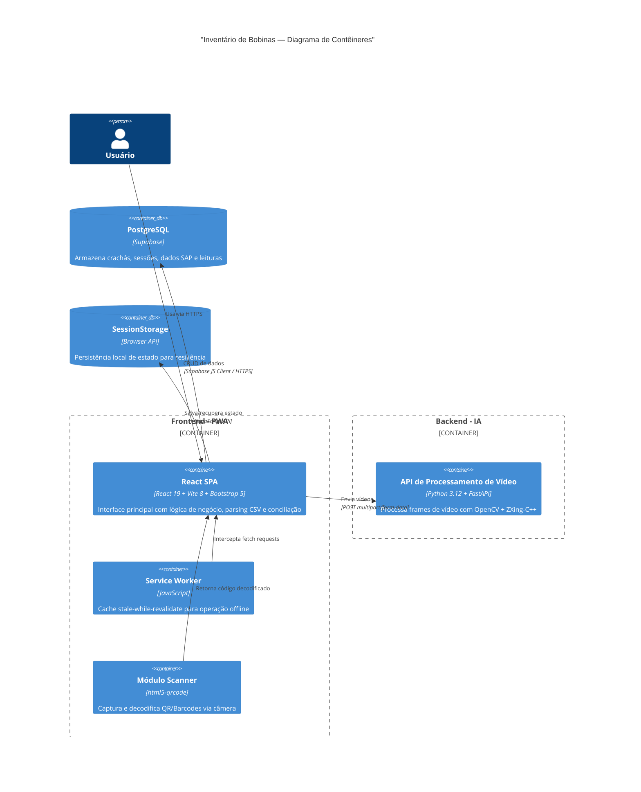

### 5.3 Nível 3 — Componentes (Frontend)

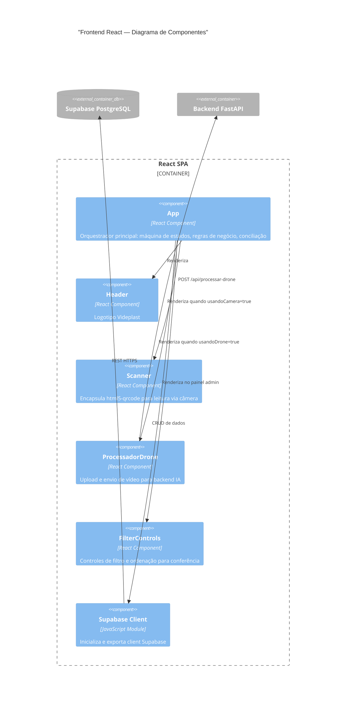

---

## 6. Justificativas para Decisões Técnicas (ADRs)

### ADR-01: Lógica de Negócio Concentrada no Frontend

- **Contexto**: Operadores usam dispositivos móveis em áreas de galpão onde o Wi-Fi/4G oscila.
- **Decisão**: A lógica principal de validação (ex: parsing de tags `VL\d+LT` e `(7)`, mapeamento de filiais e correspondência de endereço) reside diretamente no client-side React (`App.jsx`).
- **Justificativa**: Evita requisições frequentes ao servidor para decodificar expressões regulares e realizar validações simples, garantindo latência próxima a zero na interação física com leitores USB e permitindo o uso parcial sem rede estável.

### ADR-02: Supabase (PostgreSQL) como Backend-as-a-Service (BaaS)

- **Contexto**: Necessidade de rápida iteração e armazenamento estável sem sobrecarga de gerenciamento de banco relacional tradicional.
- **Decisão**: Adoção do Supabase para persistir crachás, sessões de inventário e leituras físicas.
- **Justificativa**: PostgreSQL provê consistência de dados (ACID) crucial para contagem de ativos. O Supabase abstrai a criação de APIs REST e integra-se diretamente via SDK de forma segura.

### ADR-03: Microsserviço Stateless para IA de Drone (Python + FastAPI)

- **Contexto**: O processamento de vídeos do drone com OpenCV e decodificadores de imagem pesados exige dependências nativas e processamento de CPU.
- **Decisão**: Utilização de uma API Python baseada em FastAPI executada em container Docker no Render.
- **Justificativa**: Permite separar a carga pesada de processamento de imagem do frontend. Por ser stateless, a API pode ser escalada horizontalmente de forma simples.

### ADR-04: Pipeline de Decodificação Progressivo com Early Exit (v2.2)

- **Contexto**: O pipeline original gerava 4 variações de imagem (Grayscale, Threshold Adaptativo, CLAHE, Otsu) e rodava o ZXing em todas elas para cada frame, mesmo em trechos claros e nítidos do vídeo.
- **Decisão**: Refatorar `decodificar_frame()` para um pipeline sequencial com saída antecipada (Early Exit). O algoritmo tenta cada filtro em ordem crescente de custo computacional e interrompe imediatamente ao primeiro sucesso.
- **Justificativa**: Em trechos com boa iluminação e foco (maioria dos frames úteis), o ZXing decodifica diretamente o Grayscale. Gerar os filtros CLAHE e Otsu nesses casos era trabalho desperdiçado. O Early Exit reduz o tempo médio por frame de ~150ms para ~20ms nos trechos nítidos, mantendo a mesma taxa de detecção em condições adversas.

### ADR-05: Redução da Taxa de Amostragem de 5 fps para 3 fps (v2.2)

- **Contexto**: O pipeline original analisava 5 frames por segundo de vídeo do drone.
- **Decisão**: Reduzir para 3 frames por segundo (um frame a cada ~333ms).
- **Justificativa**: Cada bobina fica visível na câmera do drone por 1 a 2 segundos em uma passagem normal de corredor. Amostrar 3 vezes por segundo garante múltiplas oportunidades de leitura por bobina, mas reduz o volume total de frames processados em ~40%, acelerando diretamente o tempo de análise.

### ADR-06: Métricas de Performance Retornadas pela API (v2.2)

- **Contexto**: O operador de drone não tinha visibilidade sobre a velocidade real de processamento da IA.
- **Decisão**: O endpoint calcula e retorna `tempo_processamento` (latência real da IA via `time.time()`) e `duracao_video` (via `total_frames / fps`) no JSON de resposta.
- **Justificativa**: O frontend usa essas métricas para exibir um painel de estatísticas com: Duração do Vídeo, Tempo de Análise, Performance (quantas vezes mais rápido que o tempo real) e total de Bobinas Detectadas. Fornece feedback valioso para o operador e para ajustes futuros de configuração.

---

## 7. Estratégia de Escalabilidade

- **Frontend**: O static site é hospedado em uma CDN global distribuída pelo Render. Escala infinitamente para novos acessos estáticos com latência mínima no carregamento de ativos.
- **API do Drone (Computação Visual)**: O container do FastAPI pode ser escalado horizontalmente (múltiplas instâncias atrás de um load balancer) para processar envios paralelos de gravações de drones sem degradar a performance da UI.
- **Banco de Dados (Supabase)**: O Supabase PostgreSQL suporta conexões escalonáveis através de Connection Pooling (pgbouncer). A tabela `bobinas_sap` e `bobinas_lidas` são indexadas por `lote`, `romaneio` e `sessao_id` para garantir buscas e inserções na ordem de milissegundos mesmo com milhões de linhas.

---

## 8. Alta Disponibilidade e Recuperação de Desastres (DR)

- **Armazenamento Seguro de Sessão**: Em caso de falha de conexão do dispositivo móvel do operador com a internet, o sistema grava o estado atual das leituras no `sessionStorage` do navegador. Se o navegador sofrer recarregamento acidental, a aplicação recupera o estado e as bobinas bipadas, prevenindo a perda do progresso do trabalho.
- **Backups de Dados**: O banco Supabase conta com backups lógicos diários automáticos. Em cenários corporativos enterprise, deve-se habilitar replicação física de leitura (Read Replicas) em outras regiões geográficas para failover rápido.

---

## 9. Estratégia de Segurança

### 9.1 Modelo de Segurança Zero Trust Proposto
- **Autenticação Baseada em Crachá**: Os operadores devem se autenticar fornecendo seu identificador de crachá corporativo.
- **Autorização (RBAC)**: Diferenciação entre operador logado comum e acesso de administrador (`admin` boolean na tabela `crachas`), limitando a visualização de painéis de auditoria globais e de exportação de dados a usuários autorizados.
- **Segurança de Transporte**: Todas as comunicações entre o cliente e o Supabase/API de processamento ocorrem estritamente via HTTPS (TLS 1.3).
- **Proteção da API (Hardening Ativo)**: Implementação de cabeçalho de autenticação `X-API-KEY` para acesso ao endpoint do drone, restrição estrita de origens no CORS (apenas domínio oficial do Render e localhost), trava contra DoS limitando uploads a 600MB e geração de UUID4 para evitar Path Traversal.
- **Row Level Security (RLS)**: Habilitar políticas de RLS no Supabase para garantir que o cliente anônimo não consiga ler/modificar tabelas sem um token JWT válido pertencente à sessão ou ao crachá em questão.

---

## 10. Estratégia de Observabilidade

- **Métricas Operacionais**: Painéis de controle indicam o ritmo de conferência (bobinas lidas por hora, taxas de sobramento e faltas por filial/depósito).
- **Rastreamento de Erros**: Configuração de logs de erro em tempo real via Sentry ou LogSnag no frontend para mapear falhas de permissão de câmera (`getUserMedia`) e bugs de conciliação.
- **Métricas de Performance do Backend (v2.2)**: O FastAPI retorna `tempo_processamento` e `duracao_video` em cada resposta do endpoint de drone. O frontend exibe um painel visual com: Duração do Vídeo, Tempo de Análise da IA, Índice de Performance (Nx mais veloz que o tempo real) e Bobinas Detectadas, criando um ciclo de feedback imediato sobre a eficiência do processamento.
- **Logs do Servidor IA**: O FastAPI utiliza logs estruturados para monitorar o tempo de decodificação de vídeos e taxa de acerto por frame, facilitando ajustes na taxa de amostragem de quadros (frames por segundo).

---

## 11. Estratégia de Integração entre Sistemas

- **Integração SAP (Etapa Atual - Manual)**: O cruzamento é realizado pela importação de arquivos CSV delimitados exportados do SAP.
- **Integração SAP (Etapa Futura - Automática)**: Conexão direta via RFC ou serviços OData (SAP Gateway) para puxar as necessidades de contagem de estoque e posições de depósito via requisições agendadas, eliminando totalmente a necessidade de importação de arquivos manuais pelos gestores.

---

## 12. Governança e Padrões de Desenvolvimento

- **Clean Code & Linting**: Uso obrigatório do ESLint com regras estritas para React 19 para prevenir vazamentos de memória (memory leaks) e uso inadequado de efeitos colaterais (`useEffect`).
- **Convenção de Nomenclatura**: Estruturas de dados e campos de tabelas seguem o padrão snake_case para compatibilidade nativa com PostgreSQL e convenção Python, enquanto propriedades locais e componentes em React utilizam camelCase/PascalCase.
- **Padrões Semânticos**: Uso estrito de semântica HTML5 no frontend para fins de acessibilidade física e suporte a leitores industriais baseados em navegadores embarcados.

---

## 13. CI/CD, DevSecOps e Automação

- **Deployment Automático (Render Git-ops)**: Qualquer push ou merge na branch principal (`main`) dispara um pipeline de implantação integrado no Render.
  - Para o frontend: O Vite compila a aplicação estática (produzindo o diretório `/dist`) que é distribuída na CDN.
  - Para o backend: O Render aciona a compilação do `Dockerfile` multi-stage, gerando e substituindo a imagem leve baseada em `python:3.12-slim` com todas as dependências pré-instaladas.
- **DevSecOps (Proposto)**: Integração de Github Actions executando `npm audit` e análise de código estático (SAST com SonarQube) para evitar vulnerabilidades de injeção em bibliotecas de terceiros.

---

## 14. Gestão de Custos e FinOps

- **Computação Serverless / PaaS**: A infraestrutura do frontend não possui custos de computação ociosa, operando em hospedagem estática gratuita/de baixo custo.
- **Escala sob demanda do Backend**: O serviço Docker do FastAPI pode ser configurado para auto-suspensão em ambientes de teste. Em ambientes produtivos, os recursos de CPU e RAM são alocados de forma fixa de acordo com a escala de inventários ativos.
- **Otimização de Armazenamento**: Imagens e arquivos de vídeo são mantidos temporariamente na memória do backend durante a extração e imediatamente deletados após o término da decodificação de códigos, evitando custos elevados com volumes persistentes.

---

## 15. Riscos Arquiteturais e Planos de Mitigação

| Identificação do Risco | Impacto | Probabilidade | Mitigação Proposta |
|-----------------------|:-------:|:-------------:|--------------------|
| **Vazamento da Chave Supabase** | Alto | Média | Utilização estrita de chaves públicas de acesso limitado e implementação de políticas de RLS (Row Level Security) no Supabase. |
| **Instabilidade de Rede** | Médio | Alta | Cache de leituras no `sessionStorage` e sincronização assíncrona tolerante a erros de conexões HTTPS com retentativas (retries). |
| **Queda de Performance no Leitor Móvel** | Alto | Baixa | Utilização de decodificadores altamente otimizados em WASM ou ZXing nativos, mantendo o controle de FPS sob limites toleráveis para o chip de CPU do smartphone. |
| **Limitação de Memória no Servidor FastAPI** | Alto | Média | Limitar o tamanho do vídeo recebido no microsserviço Python e realizar a leitura frame-a-frame por geradores, sem carregar o vídeo inteiro na memória RAM de uma única vez. |

---

## 16. Requisitos Não Funcionais e Mecanismos de Atendimento

- **RNF-01 (Performance)**: Tempo de resposta de bipagem no leitor físico inferior a **300ms** no frontend (atendido pela execução síncrona local de processamento de string e validação por regex).
- **RNF-02 (Segurança)**: Autenticação por crachás criptografada e transporte estritamente por TLS 1.3 (atendido por protocolo HTTPS forçado nas CDNs).
- **RNF-03 (Usabilidade)**: Suporte responsivo híbrido com chaveamento inteligente (atendido pelo layout dinâmico Bootstrap que oculta a tabela principal e expõe cards otimizados para telas verticais de coletores de dados e smartphones).
- **RNF-04 (Offline)**: Service Worker para caching de arquivos e código estático (atendido pelo registro do `sw.js` no client).

---

## 17. Proposta de Evolução Arquitetural

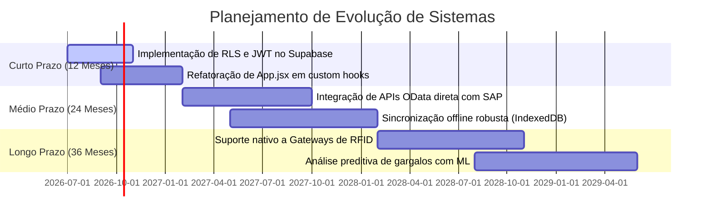

---
*Documento preparado pela equipe de Engenharia de Software e Logística da Videplast.*
